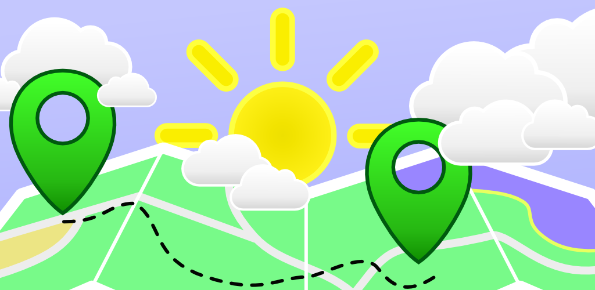

# TripWeather



An Android app for viewing weather conditions along a road trip, available on
the [Google
Playstore](https://play.google.com/store/apps/details?id=org.faudroids.tripweather).


## Setup

To successfully compile the app you will need to supply a number of API keys as part of the string resources. They are
- ```google_maps_key``` required to show the [Google Map](https://developers.google.com/maps/documentation/android/start#getting_the_google_maps_android_api_v2)
- ```google_places_key``` used for showing autocomplete for locations ([Google Places API](https://developers.google.com/places/documentation/))
- ```open_weather_map``` required to get weather forecasts from [openweathermap.org](http://openweathermap.org/api)

## The Android Challenge

This app is part of the [Android Challenge](http://faudroids.org/challenge),
where we, a [small team of students](http://faudroids.org/team/) who are
passionate about Android programming, are building one Android app every month
for one year. TripWeather is our app for February.


## Feedback

TripWeather is far from perfect nor is it meant to be a finished product (one
month just isn't enough). For us the Android Challenge is more about
prototyping apps quickly to see if an idea could work. So if you have found
TripWeather useful or like the idea, don't hesitate to [drop us a
note](http://faudroids.org/contact). Of course you can also directly send us a
pull request with the feature you would like to see!


## License
Copyright 2015 FauDroids

Licensed under the Apache License, Version 2.0 (the "License");
you may not use this file except in compliance with the License.
You may obtain a copy of the License at

http://www.apache.org/licenses/LICENSE-2.0

Unless required by applicable law or agreed to in writing, software
distributed under the License is distributed on an "AS IS" BASIS,
WITHOUT WARRANTIES OR CONDITIONS OF ANY KIND, either express or implied.
See the License for the specific language governing permissions and
limitations under the License.
